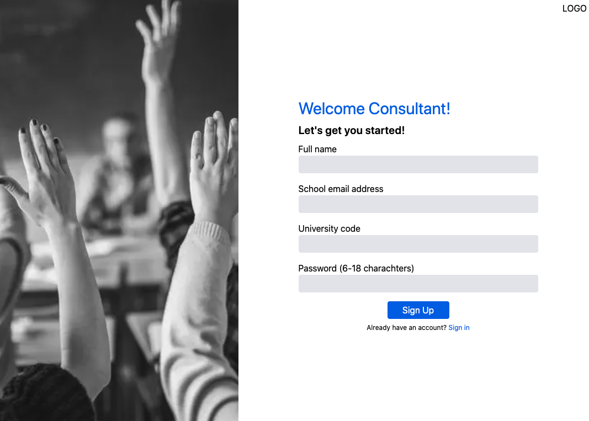
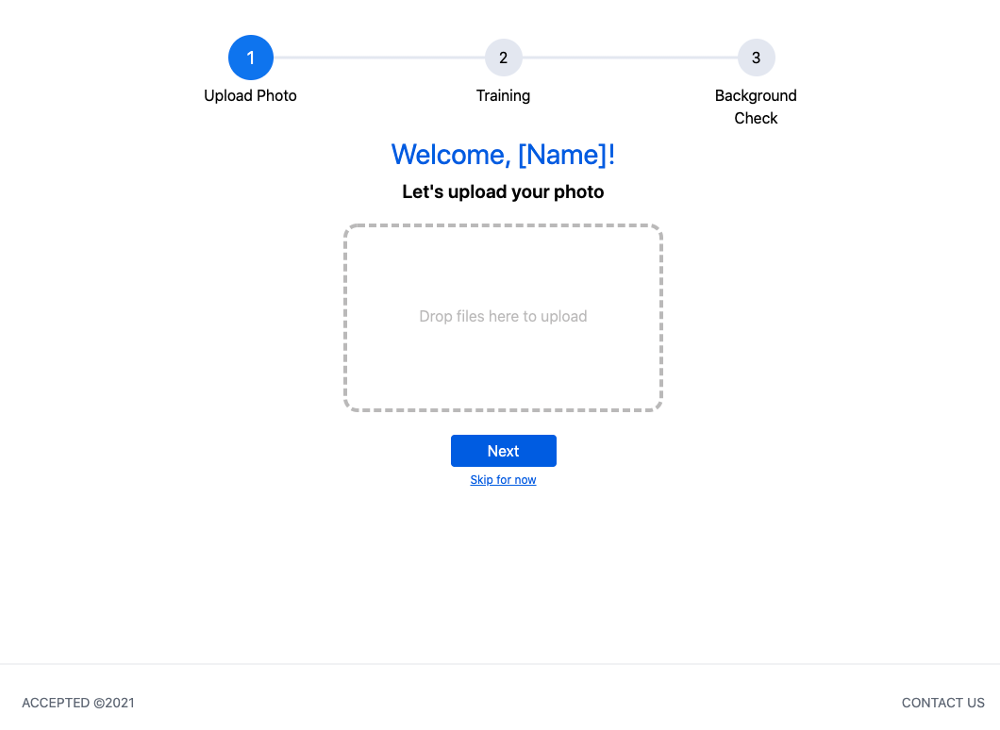
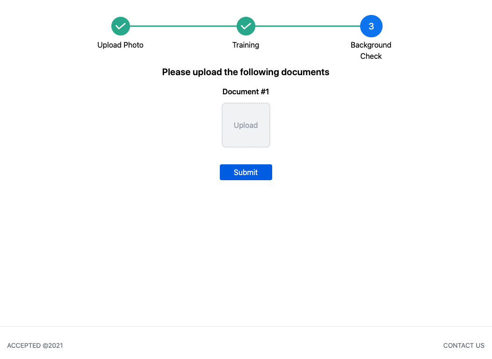
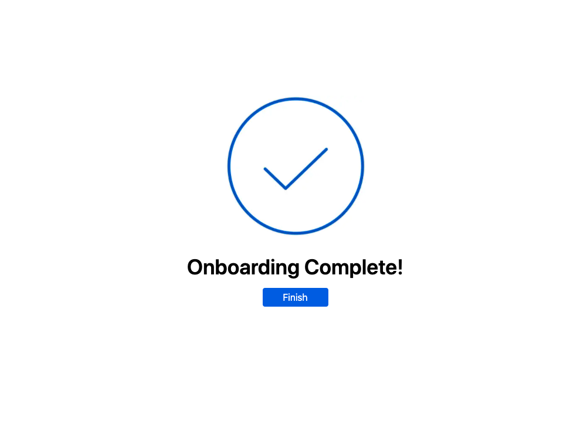
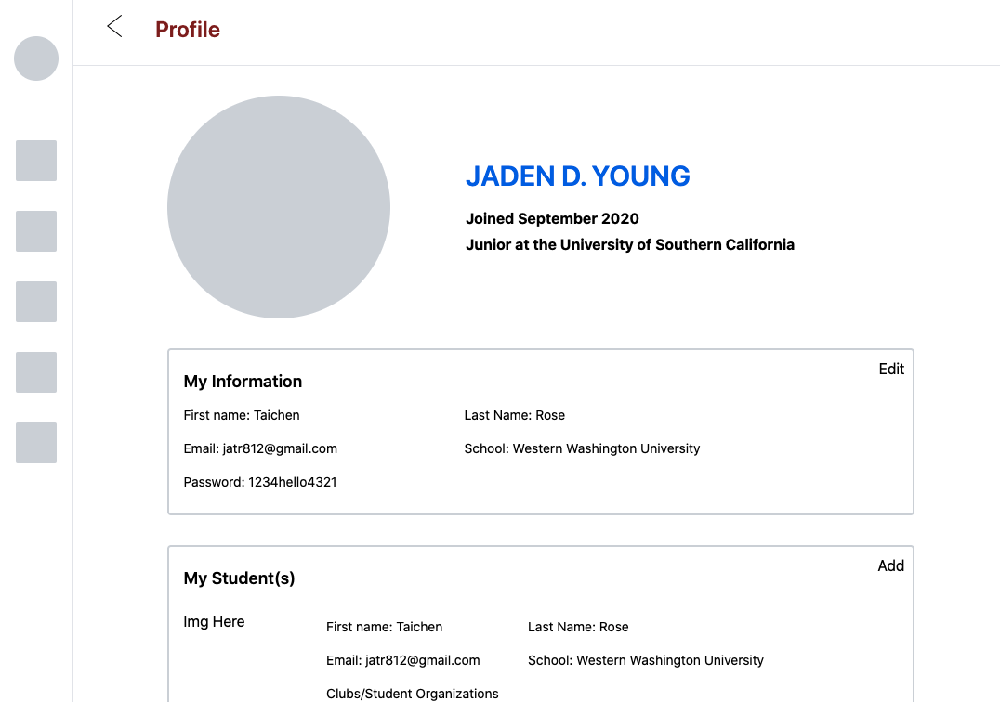

## Developer Team Members

After informing all the developers that we believe Next.JS is the best framework for this project, all backend developers are currently learning the strengths of Prisma and the functions that Next uses to render dynamic web content. The frontend developers have started to plan out the cards and components that need to be made for this project.

We have a scheduled meeting with the Design team during the week of April 19 - April 23. There has been a delay with the design team in forwarding us the final designs, so we will meet with them to discuss the feasability of new features they plan to introduce.

While we wait, we expect to get our developers semi familiar with the NextJS framework.

## Current Practice With Next

The images below are all static examples of Taichen playing around with the NextJS framework. Walker is currently familiarizing himself with Prisma since he will be the lead in developing the Database for our project and connecting it to our application.

This is an example of the sign in page

Here is an example of onboarding 1 page

Here is onboarding 3 page

This will be the finished onboarding place

Profile page example

